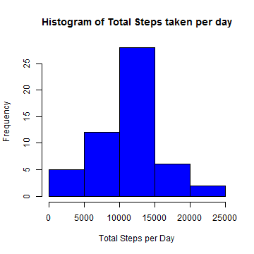
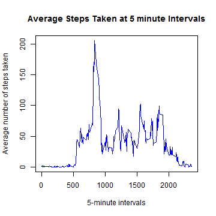
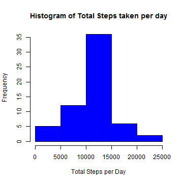
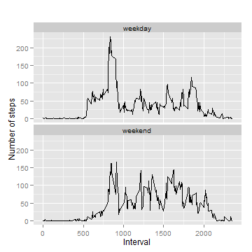

Reproducible Research Peer Assessment 1
========================================================
### Loading and preprocessing the data


```r
#load activity data into data frame
df_activity <- read.csv("activity.csv")

#remove rows with NA for part of assigment where the missing values in the dataset can be ignored
df_activity_no_na <- na.omit(df_activity)
```

### What is mean total number of steps taken per day?
For this part of the assignment, you can ignore the missing values in the dataset.

#### Make a histogram of the total number of steps taken each day

```r
#Make a histogram of the total number of steps taken each day

df.tot.steps <- aggregate(steps ~ date, data = df_activity_no_na, FUN = "sum")

hist(df.tot.steps$steps, main = "Histogram of Total Steps taken per day", col = "blue", xlab = "Total Steps per Day")
```

 

```r
#Calculate and report the mean and median total number of steps taken per day

#mean
steps.mean <- mean(df.tot.steps$steps)
steps.mean
```

```
## [1] 10766
```

```r
#median
steps.median <- median(df.tot.steps$steps)
steps.median
```

```
## [1] 10765
```
### What is the average daily activity pattern?

```r
#Make a time series plot (i.e. type = "l") of the 5-minute interval (x-axis) and the average number of steps taken, averaged across all days (y-axis)
df.interval.steps <- aggregate(steps ~ interval, df_activity_no_na, mean)

plot(df.interval.steps$interval, df.interval.steps$steps, type='l', 
     col = "blue",main = "Average Steps Taken at 5 minute Intervals", 
     xlab = "5-minute intervals", ylab = "Average number of steps taken")
```

 

```r
#Which 5-minute interval, on average across all the days in the dataset, contains the maximum number of steps?
max.indx <- which.max(df.interval.steps$steps)

df.interval.steps [max.indx , ]
```

```
##     interval steps
## 104      835 206.2
```
#### The interval 835 has the maximum average number of steps 206.1698.

### Imputing missing values

Note that there are a number of days/intervals where there are missing values (coded as NA). The presence of missing days may introduce bias into some calculations or summaries of the data.


```r
#Calculate and report the total number of missing values in the dataset (i.e. the total number of rows with NAs)
na_rows <- length(df_activity$step[is.na(df_activity$step)])
na_rows
```

```
## [1] 2304
```

```r
#also could be done by nrow(df_activity) - nrow(df_activity_no_na) from above

#Devise a strategy for filling in all of the missing values in the dataset. 
#The strategy does not need to be sophisticated. For example, you could use the mean/median for that day, 
#or the mean for that 5-minute interval, etc.

#Create a new dataset that is equal to the original dataset but with the missing data filled in.
#For simplicity, I will be using mean for interval to fill NA from data frame df.interval.steps generated above

#get NA only data frame
df_activity_fix <- df_activity[which(is.na(df_activity$step)),]
#fill NA with values from df.interval.steps$steps join by common "interval" column
df_activity_fix <- merge(df_activity_fix, df.interval.steps, by=c("interval"))

#reorange the dataset
df_activity_fix <- df_activity_fix[,c(steps="steps.y", "date", "interval")]
#rename column to match original column name
colnames(df_activity_fix)[1]="steps"

##Create a new dataset that is equal to the original dataset but with the missing data filled in.
#merge data frame with no NA with data frame filled NAs
df_activity_new <- rbind(df_activity_no_na, df_activity_fix)

#Make a histogram of the total number of steps taken each day and Calculate and report the mean and median total number of steps taken per day. Do these values differ from the estimates from the first part of the assignment? What is the impact of imputing missing data on the estimates of the total daily number of steps?

#Make a histogram of the total number of steps taken each day

df.tot.steps.new <- aggregate(steps ~ date, data = df_activity_new, FUN = "sum")

hist(df.tot.steps.new$steps, main = "Histogram of Total Steps taken per day", col = "blue", xlab = "Total Steps per Day")
```

 

```r
#mean
steps.mean.new <- mean(df.tot.steps.new$steps)
steps.mean.new
```

```
## [1] 10766
```

```r
#median
steps.median.new <- median(df.tot.steps.new$steps)
steps.median.new
```

```
## [1] 10766
```

```r
#no changes in mean and median, no impact
```
#### No changes in mean and median, no impact. And histogram shows a similar shape as before.

### Are there differences in activity patterns between weekdays and weekends?


```r
#create new variable to hold weekday names

df_activity_new$weekday <- as.Date(df_activity_new$date, "%Y-%m-%d")
df_activity_new$weekday <- weekdays(df_activity_new$weekday)

#create new factor variable "dayweek" in the dataset with two levels - "weekday" and "weekend" indicating whether a given date is a weekday or weekend day.

df_activity_new$dayweek = "weekday"

#assign "weekend" to Saturday and Sunday
df_activity_new[df_activity_new$weekday == "Saturday",]$dayweek = "weekend"
df_activity_new[df_activity_new$weekday == "Sunday",]$dayweek = "weekend"

#Make a panel plot containing a time series plot (i.e. type = "l") of the 5-minute interval (x-axis) and the average number of steps taken, averaged across all weekday days or weekend days (y-axis). The plot should look something like the following, which was creating using simulated data:

library(ggplot2)
df_activity_new_week <- aggregate(steps ~ interval+dayweek, df_activity_new, mean)

qplot(interval, steps, data=df_activity_new_week, geom=c("line"), xlab="Interval", 
      ylab="Number of steps", main="") + facet_wrap(~ dayweek, ncol=1)
```

 
